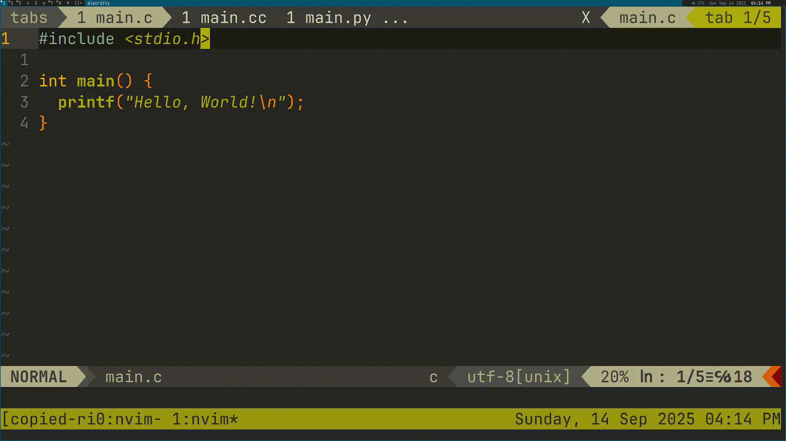

# ©️ Copied Rights
A lightweight Neovim plugin that aids in inserting copyright headers into files.



## 📦 Installation
To install with default configuration using Lazy, use the installation snippet
below. Once it is installed, headers can be inserted using the `:CopiedRights`
command in Neovim. To add more headers, see the Configuration section below.
```lua
return {
  "kolin63/copied-rights",

  config = function()
    require("copied-rights").setup({
      -- if file is encountered, the search for an override file will stop
      search_stop = { ".git/" },

      -- how many directories to move back through for an override file search
      max_search = 4,

      -- if only this amount of chars are different, then header will be
      -- replaced rather than a new one being added
      max_diff = 4,

      -- file name for override files
      override_file = ".copied-rights.lua",

      headers = {
        {
          file = "*.lua",
          -- command = "example",
          lines = {
            "-- this is an example header",
            "-- Copyright (c) John Doe %Y",
            ""
          }
        }
      },
    })
  end
}
```

## ⚙️ Configuration
The structure of a header configuration is as follows:
```lua
{
  file = "*.c", -- mandatory
  command = "test", -- optional
  lines = { -- mandatory
    "// test line 1",
    "// test line 2",
    "// date and time format: %Y",
    "",
  }
}
```

### Parameter Description
* `file` is what files this will be executed in. When `:CopiedRights` is ran,
  the buffer name will be checked against this pattern. Very basic globbing is
  supported, and `*` is the only symbol that works.
* `command` is an optional parameter that expands upon `file`. If a command
  name is specified, that header will be added when `:CopiedRights
  command_name` is ran. Keep in mind that the command will only work in the
  file types specified by the `file` parameter. If the desired effect is for
  the command to work in all files, `file` can be simply set to `*`.
* `lines` is a comma-separated list of strings that defines the content of the
  header. Extensive time and date formatting is supported. See [man
  strftime](https://www.man7.org/linux/man-pages/man3/strftime.3.html) for a
  full list.

### Override Files
Copied Rights also allows the user to define override files, which can specify
unique headers for different projects. The default file name is
`.copied-rights.lua`, but it can be configured (see above). A good standard for
using override files would be to place them in the project's root directory,
where files like `.git/` would be located.

The structure of an override file is as follows:
```lua
return {
  {
    file = "*.c",
    lines = {
      "// a header"
    }
  },
  {
    -- another header
  },
  {
    -- another header
  },
  -- ...
}
```
